[](https://classroom.github.com/a/xLkBlQ7x)
[](https://classroom.github.com/open-in-codespaces?assignment_repo_id=22383748)

# No Safe Ground

Authors: [Christopher Jung](https://github.com/chrisjung0919)
            [Dylan Lam](https://github.com/dlam318)
	    [Ryan Trinh](https://github.com/rtrin026) [Asir Mazhar](https://github.com/asirmazhar23)

## Project Description

* **Why is it important or interesting to you?**  
This project is important to us because it helps demonstrate our creative sides while also utilizing our technical skills. We enjoy playing games and imagined we would have just as much fun making a game of our own.

* **What languages/tools/technologies do you plan to use?**  
We plan to use C++ as the main programming language to practice object-oriented programming and problem-solving. We will use Google Test to test key parts of the program and ensure correctness. An ASCII letter art generator will be used to create visual elements such as menus and titles for the text-based interface.

* **What will be the input/output of your project?**  
The input will be keyboard commands that control player actions such as movement and combat. The output will be a text-based display shown in the terminal, which updates based on player actions and game events.

* **What are the features that the project provides?**  
The project will include features such as player movement, combat and attacking, leveling up, item usage, and buying items through a shop system. These features work together to create an interactive and engaging text-based game experience.

[Kanban board link](https://trello.com/invite/b/69784ad5e394a7bd4bdd78a6/ATTIe7bf5bb5e74d4dd3c050582117bbf5acAA61AB9E/kanban-template )


## User Interface Specification

### Navigation Diagram
Below is the navigation Diagram of the No Safe Ground game. The screens are set up as a nodes which can be navigated after completing that screens task. Certain screens like inventory, character status, and shop/merchant can be accessed anywhere in the game process. In special cases there are side quest options that can lead to a side quest which will add more nodes to the list and create for a interesting unique story line every play. With the node based structure we are able to create easy updates by appending new story lines or arc as we seem fit. Of course at the end of each side Quest youll return back to the main story once done.

 


### Screen Layouts

The user interface and screen layouts for the terminal-based RPG are documented in the PDF below:

📄 **[No Safe Ground – Screen Layouts (PDF)](docs/No%20Safe%20Ground%20-%20Screen%20Layouts%20Version%202.pdf)**

<!-- ## Class Diagram

 [UML diagram link](https://lucid.app/lucidchart/a0e5c3a8-75e6-4f3c-a4fe-f58a24985e8b/edit?viewport_loc=-1078%2C-1134%2C3929%2C3425%2C0_0&invitationId=inv_07f0c992-13e1-4d0a-b930-eecc87d685c1) -->

## UML Class Diagram (Updated)

 [UML diagram link - With SOLID principles](https://lucid.app/lucidchart/6c63afc4-2755-4f9e-afc6-525e12f87b9d/edit?viewport_loc=-5342%2C-663%2C4165%2C3299%2C0_0&invitationId=inv_b5a26e77-077d-45cc-85cb-ecd1bc6449b7)

## Description For Each Update
We applied the SRP change by having Game class only control running, initializing, and ending the game. Then we moved the switch screen logic from Game class to a screen manager interface. This helped our code by leaving Game class to only handle one responsiblity and letting screen manager handle our screen transitions.

In this next update, we applied SRP again because we originally had Combat be controlled in the Combat screen class. In Combat screen it handled displaying the enemy and the combat log all while controlling the game's battle functions. By separating it into different interfaces, each interface only had one responsiblity making our code clear what purpose it is supposed to carry out.

For the third update, we applied the interface segregation principle by making a new navigation class. The navigation function was in the Screen class which not all screens used. Instead of having all screen be forced to have a function they do not need, our code becomes much better now that this new class separates it from Screen class.
 
 ## Screenshots

<table>
  <tr>
    <td>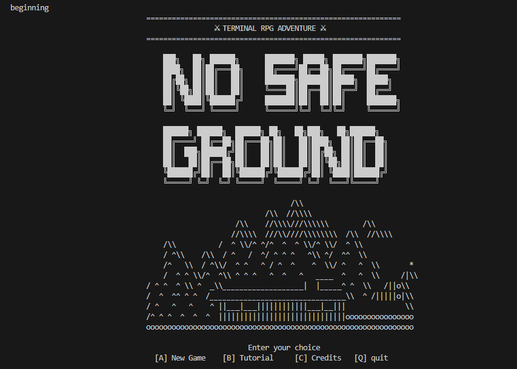</td>
    <td>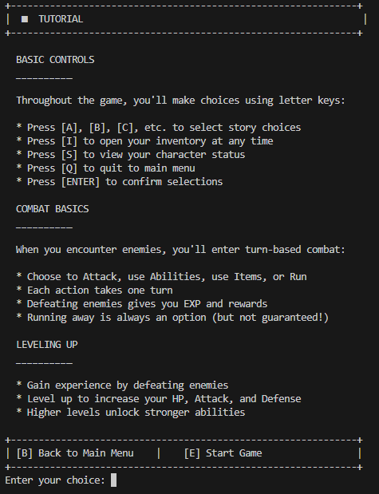</td>
    <td>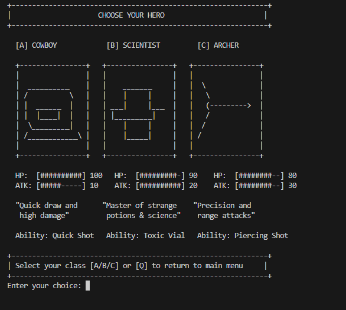</td>
  </tr>
  <tr>
    <td>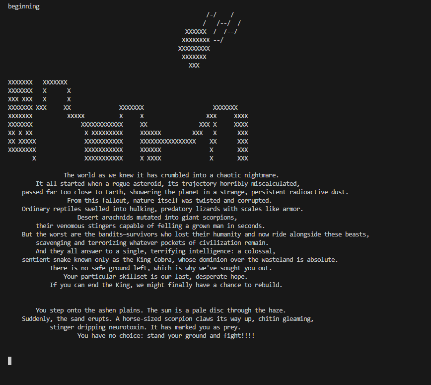</td>
    <td>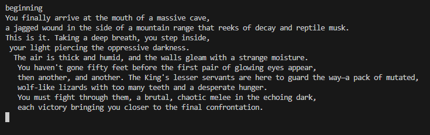</td>
    <td>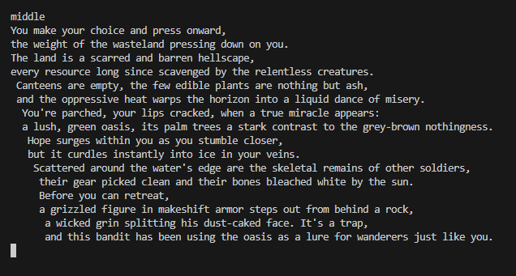</td>
  </tr>
  <tr>
    <td>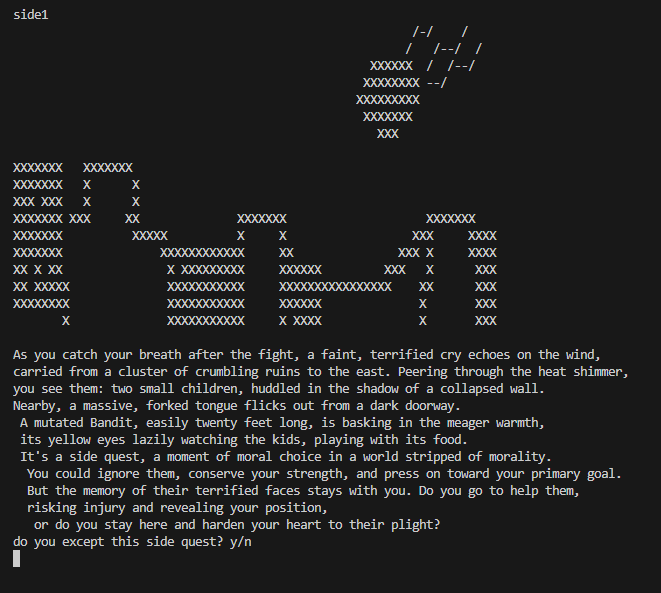</td>
    <td>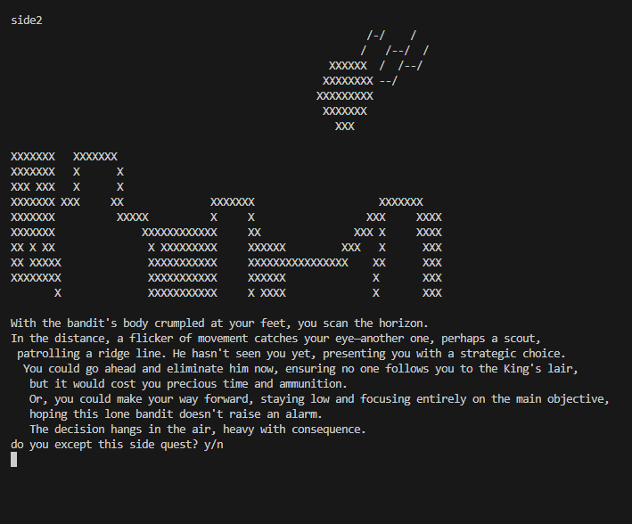</td>
    <td>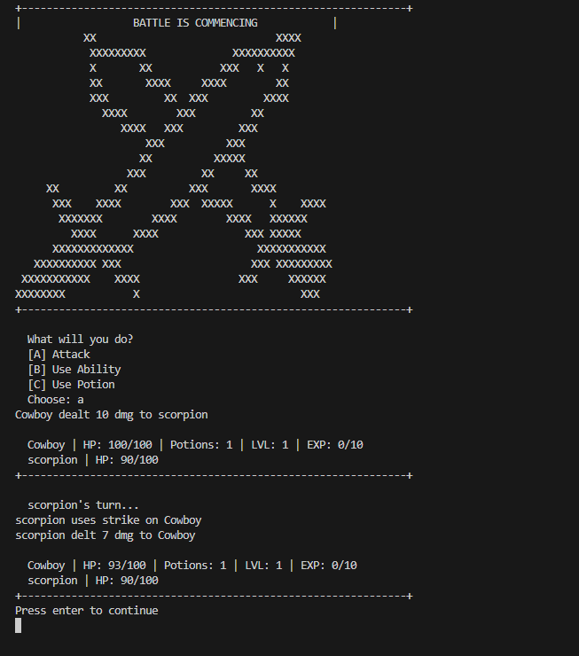</td>
  </tr>
  <tr>
    <td>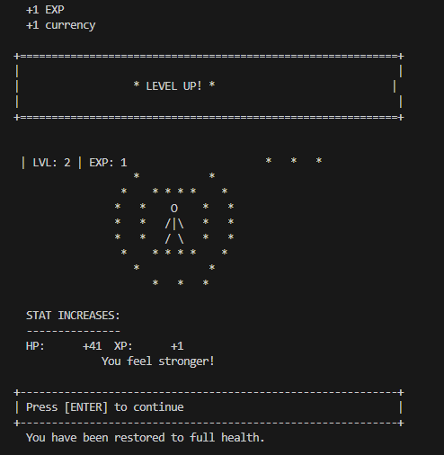</td>
    <td>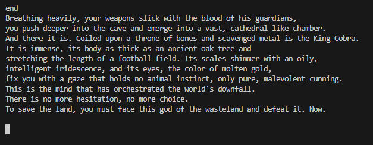</td>
    <td>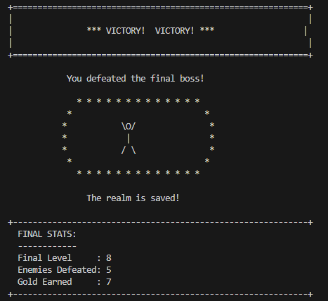</td>
  </tr>
  <tr>
    <td colspan="3" align="center">
      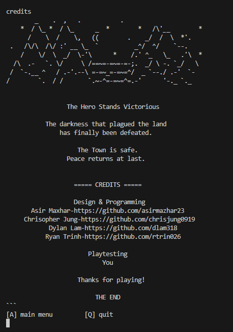
    </td>
  </tr>
</table>

## Installation/Usage

### **1. Clone the Repository**
 
```bash
git clone https://github.com/cs100/final-project-cool-rpg-game-team.git
cd final-project-cool-rpg-game-team
```
 
---
 
## **Running the Game**
 
### **2. Navigate to the Game Build Directory**
 
```bash
cd linked-lists/
```
 
### **3. Build the Project**
 
```bash
cmake .
make
```
 
### **4. Start the Game**
 
```bash
./game
```
 
You will see the start menu in the terminal where you can choose:
 
| Key | Action |
|-----|--------|
| **[A]** | New Game |
| **[B]** | Tutorial |
| **[C]** | Credits |
| **[Q]** | Quit Game |
 
---
 
## **Running Unit Tests**
 
### **5. Navigate to the Build Directory**
 
```bash
cd build
```
 
### **6. Build the Tests**
 
```bash
cmake ..
make
```
 
### **7. Run the Test Suite**
 
```bash
./bin/test
```
 
This runs all GoogleTest test cases used to verify the functionality of the game's components, including hero and enemy class logic.

 ## Testing
We used **GoogleTest**, a C++ testing framework developed by Google, to write unit tests for our code. This submodule is installed using the recursive flag when cloning the repo. Our unit tests covered the three main vital classes of our program — **Character**, **Enemy**, and **Hero**. We made sure to use a combination of both `ASSERT` and `EXPECT` in our unit tests with appropriate usage.
 
For many of our setter and constructor functions, we threw exceptions for invalid inputs such as negative health, damage, and level values, or empty name strings, demonstrating **offensive programming**. We made sure to test these using `EXPECT_THROW`. The test files can be found in `test/character_test.cpp`, `test/enemy_test.cpp`, and `test/hero_test.cpp`, and the executable created by CMake can be run with `./bin/test`.
 
We also tested our enemy subclasses (`scorpion`, `bandit`, `lizard`, `finalBoss`) individually to confirm correct construction and starting stats, and verified that hero progression mechanics like `expIncrease()`, `currencyIncrease()`, and `rest()` all behave correctly during gameplay.
 
Here are some examples of the cases we tested and fixed our code to handle:
 
1. Characters cannot be constructed or have their stats set with negative values — an `invalid_argument` exception is thrown and caught.
2. A character's `isAlive()` correctly returns false once their health reaches zero after taking damage from an attack.
3. Each hero subclass (`cowboy`, `scientist`, `archer`) correctly stuns an enemy and sets the ability-used flag when their unique ability is activated.
4. The `rest()` function correctly restores a hero's health to maximum whether they are damaged or already at full health.
